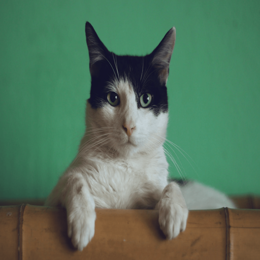
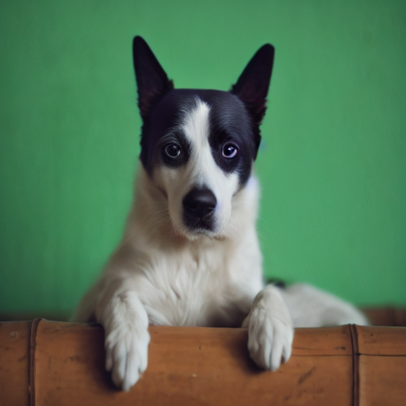
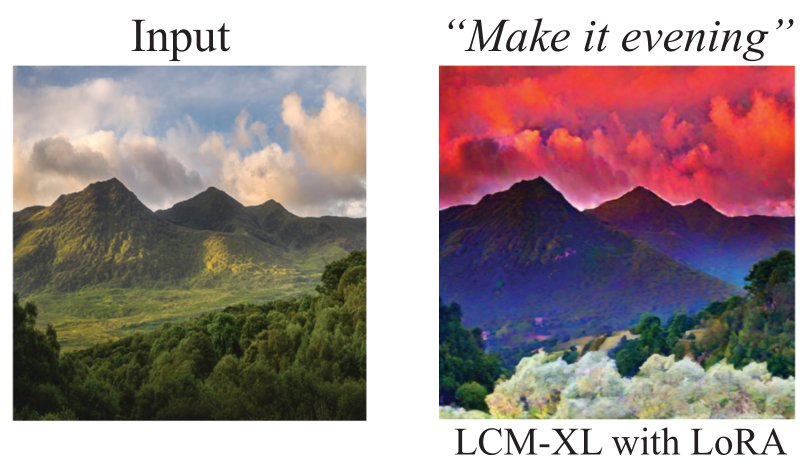
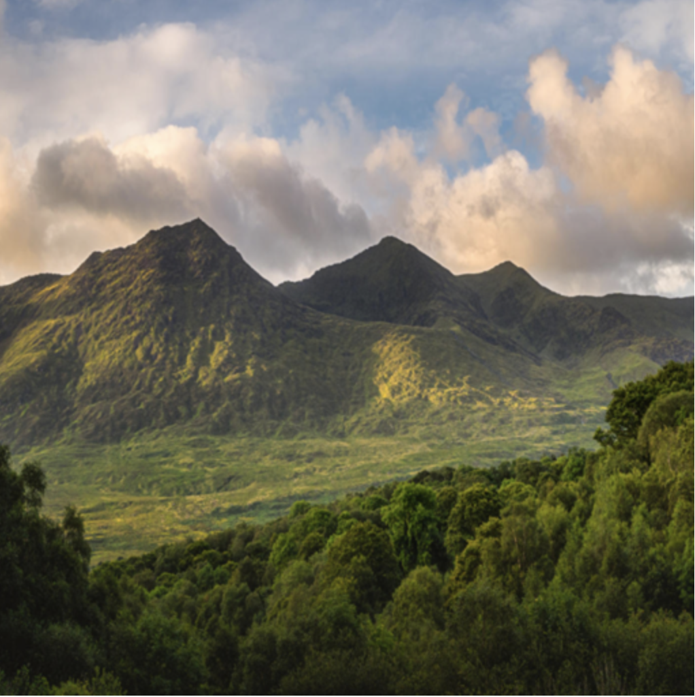
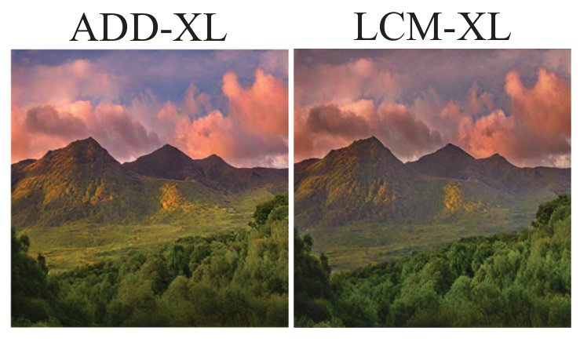
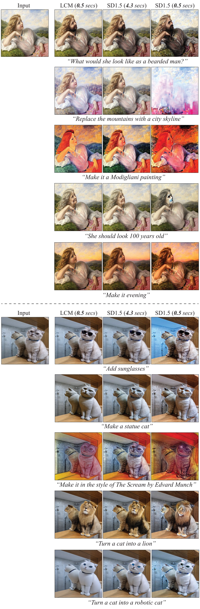
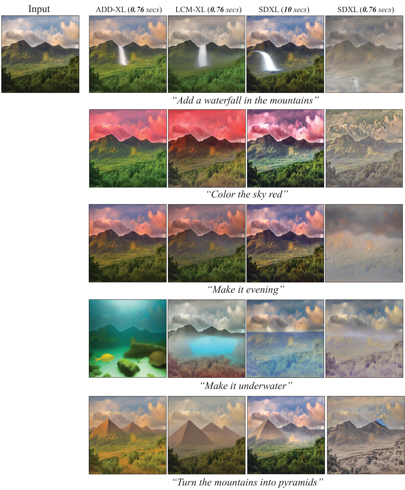

# Fast InstructPix2Pix using Distilled Text-conditional Diffusion Models

<p align="center">

</p>

> <i>Overview</i> <br> 
> 
> **Recent distillation approaches could significantly accerate the inference of text-conditional diffusion models.
> Here, we demonstrate that the distilled models can be readily combined with the high-end image editing approach, [InstructPix2Pix](https://github.com/timothybrooks/instruct-pix2pix/tree/main), 
> without any training.
> We adapt the InstructPix2Pix models based on [Stable Diffusion v1.5](https://arxiv.org/abs/2112.10752) and [Stable Diffusion XL](https://arxiv.org/abs/2307.01952) 
> using the pretrained [Latent Consistency Models](https://arxiv.org/abs/2310.04378)
> and [Adversarial Diffusion Distillation](https://arxiv.org/abs/2311.17042).
> The final pipeline performs the text-guided image editing for 4-5 steps without noticeable quality degradation.**
>
> <i>How does it work?</i> <br>
> 
> **The InstructPix2Pix parameters are updated according to $`W^{*}_{IP2P} = W_{IP2P} + \Delta W`$, where
> $`\Delta W = W_{1} - W_{0}`$. $`W_0`$ are the base diffusion model parameters, e.g., SD1.5 or SDXL, and
> $`W_1`$ are the parameters of the corresponding distilled version.**
> 
> **Also, $`\Delta W`$ can be obtained using LoRA adapters.
> First, the diffusion model is distilled into LoRA, 
> $`W_{1} = W_{0} + \Delta W_{LoRA}`$, that is usually added to the attention layers only.
> Then, we can adapt InstructPix2Pix using $`\Delta W = \Delta W_{LoRA}`$.
> Note that, in our experiments, InstructPix2Pix-XL performs much better using the fully parametrized distilled models for adaptation.**
>
> *The inference times are measured on a single NVIDIA-A100.

To run the code below, install [diffusers](https://github.com/huggingface/diffusers).
```Python
pip install diffusers==0.23.1
```

## Editing with LCM-SD1.5
Here, we adapt [InstructPix2Pix](https://github.com/timothybrooks/instruct-pix2pix/tree/main) based on SD1.5 using [LCM-SD1.5-LoRA](https://huggingface.co/latent-consistency/lcm-lora-sdv1-5).

1. Load an image to edit.

```Python
from diffusers.utils import load_image

url = "https://huggingface.co/datasets/huggingface/documentation-images/resolve/main/diffusers/cat.png"
resolution = 512

init_image = load_image(url).resize((resolution, resolution))
```
<p align="center">

</p>

2. Initialize the pipelines and load the LoRA parameters.
```Python
from diffusers import StableDiffusionInstructPix2PixPipeline, LCMScheduler

# InstructPix2Pix with LCM specified scheduler
pipe = StableDiffusionInstructPix2PixPipeline.from_pretrained(
       "timbrooks/instruct-pix2pix", torch_dtype=torch.float16
       )
pipe = pipe.to("cuda")
pipe.scheduler = LCMScheduler.from_config(pipe.scheduler.config)

# Adapt the InstructPix2Pix model using the LoRA parameters
adapter_id = "latent-consistency/lcm-lora-sdv1-5"
pipe.load_lora_weights(adapter_id)
```

3. Run editing.
```Python
edit_instruction = "Turn a cat into a dog"
image = pipe(prompt=edit_instruction, 
             image=init_image,
             num_inference_steps=4, 
             guidance_scale=2.0,
             image_guidance_scale=1.0,
             generator=generator,
             ).images[0]
```
<p align="center">

</p>

You can find more examples [here](#examples-with-lcm-sd15).

> <i>Recomendations</i> <br>
> 
> **a) Turn off ```image_guidance_scale``` (set to ```1```). Otherwise, it will cause artifacts.** <br>
> **b) Vary ```guidance_scale``` between ```1``` and ```3```. The larger values can potentially lead to more artifacts.** <br>
> **c) Different resolutions are suitable (e.g, ```1024```). However, ```512``` works slightly better.** <br>

## Editing with LCM-XL and ADD-XL
For SDXL, we found that [LCM-LoRA-XL](https://huggingface.co/latent-consistency/lcm-lora-sdxl) leads to 
the unsatisfactory results, see the example below. 
<p align="center">

</p>

However, we observe that the [LCM-XL](https://huggingface.co/latent-consistency/lcm-sdxl) and 
[ADD-XL](https://huggingface.co/stabilityai/sdxl-turbo) checkpoints can be successfully used for the InstructPix2Pix-XL adaptation.

1. Load an image

```Python
from diffusers.utils import load_image

url = "https://hf.co/datasets/diffusers/diffusers-images-docs/resolve/main/mountain.png"
resolution = 768

init_image = load_image(url).resize((resolution, resolution))
```
<p align="center">

</p>

2. Initialize the pipelines
```Python
from diffusers import DiffusionPipeline, StableDiffusionXLInstructPix2PixPipeline, AutoPipelineForText2Image
from diffusers import UNet2DConditionModel, LCMScheduler

# InstructPix2Pix-XL with LCM specified scheduler
pipe_p2p = StableDiffusionXLInstructPix2PixPipeline.from_pretrained(
        "diffusers/sdxl-instructpix2pix-768",
        torch_dtype=torch.float16
       )
pipe_p2p = pipe_p2p.to("cuda")
pipe_p2p.scheduler = LCMScheduler.from_config(pipe_p2p.scheduler.config)

# SDXL
pipe_sd = DiffusionPipeline.from_pretrained(
    "stabilityai/stable-diffusion-xl-base-1.0", torch_dtype=torch.float16, variant="fp16", use_safetensors=True
)
pipe_sd = pipe_sd.to("cuda")

# ADD-XL (SDXL-Turbo)
pipe_turbo = AutoPipelineForText2Image.from_pretrained("stabilityai/sdxl-turbo",
                                                 torch_dtype=torch.float16, variant="fp16")
pipe_turbo.to("cuda")

# LCM-XL
unet = UNet2DConditionModel.from_pretrained("latent-consistency/lcm-sdxl", torch_dtype=torch.float16, variant="fp16").to("cuda")
pipe_lcm = DiffusionPipeline.from_pretrained("stabilityai/stable-diffusion-xl-base-1.0", unet=unet, torch_dtype=torch.float16, variant="fp16")
pipe_lcm.scheduler = LCMScheduler.from_config(pipe_lcm.scheduler.config)
```

**Adapt InstructPix2Pix-XL**

```Python
import torch

@torch.no_grad()
def adapt(pipe_p2p, pipe_distill, pipe_sd, weight=0.5):
    """
    Adaptation of pipe_p2p with pipe_distill and pipe_sd inspired by LoRA adapters
    """
    
    state_dict_p2p = pipe_p2p.unet.state_dict()
    state_dict_distill = pipe_distill.unet.state_dict()
    state_dict_sd = pipe_sd.unet.state_dict()
    
    for name, param in state_dict_p2p.items():
        
        # Skip the first layer, since it has more input channels than in the distill model.
        if name == 'conv_in.weight':
            continue
        
        # Compute weight residuals
        W_delta = state_dict_distill[name] - state_dict_sd[name] 
        
        # Update parameters
        transformed_param = param + weight * W_delta
        param.copy_(transformed_param)

# Adapt InstructPix2Pix-XL using the selected distillation method
adapt(pipe_p2p=pipe_p2p,
      pipe_distill=pipe_turbo, # or pipe_lcm
      pipe_sd=pipe_sd,
      weight=0.5) 
```

3. Run editing.
```Python
edit_instruction = "Make it evening"
edited_image = pipe_p2p(
        prompt=edit_instruction,
        image=init_image,
        height=resolution,
        width=resolution,
        num_inference_steps=5,
        guidance_scale=2.0,
        image_guidance_scale=1.0,
        ).images[0]
```

<p align="center">

</p>

You can find more examples [here](#examples-with-lcm-sdxl-and-add-xl).

> <i>Recomendations</i> <br>
> 
> **a) As in the previous case, turn off ```image_guidance_scale``` (set to ```1```).** <br>
> **b) Vary ```guidance_scale``` between ```1``` and ```3```.** <br>
> **c) Only one resolution is suitable, ```768```. Others lead to the unsatisfactory results.** <br>
> **d) The pipeline is highly sensitive to the ```weight``` parameter. We found that ```0.5``` is acceptable.** <br>
> **e) InstructPix2Pix-SD1.5 works significantly better than the SDXL counterpart. Thus, we recommend using the previous pipeline.**

## Examples with LCM-SD1.5
<p align="center">

</p>

## Examples with LCM-SDXL and ADD-XL
<p align="center">

</p>

## References
```bibtex
@article{brooks2022instructpix2pix,
  title={InstructPix2Pix: Learning to Follow Image Editing Instructions},
  author={Brooks, Tim and Holynski, Aleksander and Efros, Alexei A},
  journal={arXiv preprint arXiv:2211.09800},
  year={2022}
}

@article{luo2023latent,
  title={Latent consistency models: Synthesizing high-resolution images with few-step inference},
  author={Luo, Simian and Tan, Yiqin and Huang, Longbo and Li, Jian and Zhao, Hang},
  journal={arXiv preprint arXiv:2310.04378},
  year={2023}
}

@article{luo2023lcm,
  title={Lcm-lora: A universal stable-diffusion acceleration module},
  author={Luo, Simian and Tan, Yiqin and Patil, Suraj and Gu, Daniel and von Platen, Patrick and Passos, Apolin{\'a}rio and Huang, Longbo and Li, Jian and Zhao, Hang},
  journal={arXiv preprint arXiv:2311.05556},
  year={2023}
}

@article{sauer2023adversarial,
  title={Adversarial Diffusion Distillation},
  author={Sauer, Axel and Lorenz, Dominik and Blattmann, Andreas and Rombach, Robin},
  journal={arXiv preprint arXiv:2311.17042},
  year={2023}
}
```
